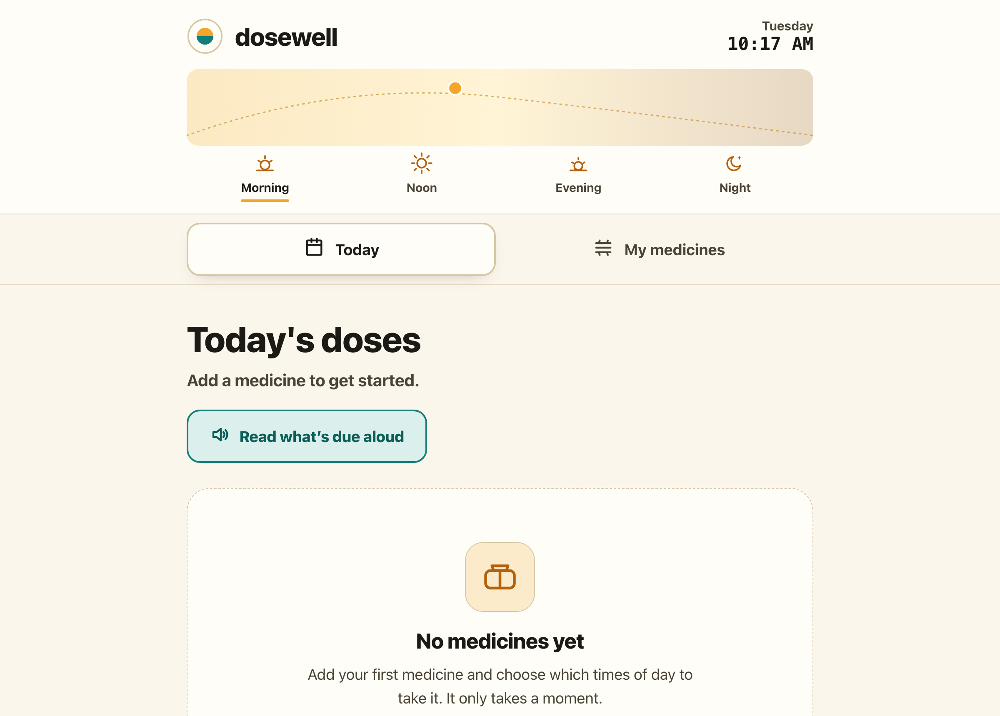

# dosewell

**Never miss a dose — one gentle tap at a time.** A big, calm, elder-friendly medication reminder. Add the medicines you take, choose which times of day (Morning, Noon, Evening or Night), and tap one giant button when a dose is taken. 100% client-side, zero dependencies, works fully offline.

## Why

Most medication apps are built for phones and for people comfortable with phones — tiny buttons, exact clock times, accounts, sign-ups, and a stream of notifications. For an older person, or a caregiver setting things up on their behalf, that is more friction than help.

dosewell strips it back to the one job that matters: **at a glance, what still needs to be taken today, and a single obvious way to mark it done.** Times are grouped into four plain day-parts instead of clock times, because "Morning" is easier to read and remember than "08:00". The type is large, the contrast is high, and every dose has one big **Taken** button. That's it.

## Features

- **Simple day-parts, not clock times** — each medicine is scheduled for Morning, Noon, Evening and/or Night. Easier to read, easier to remember.
- **A Today view that answers one question** — doses grouped by time of day, with a running "3 of 5 doses taken today" so you always know where you stand. Taken doses dim and drop to the bottom.
- **One giant Taken button per dose** — marked done for *today*, saved against the calendar date, and reset automatically when a new day begins.
- **Optional pill photo** — if your device has a camera, snap a photo of the pill or box so each medicine is easy to recognise. You can always skip it.
- **Read aloud** — a "Read what's due aloud" button uses your browser's built-in voice to speak the doses still due right now.
- **Built for older eyes and hands** — extra-large text, high-contrast warm colours, big touch targets, full keyboard support, and it respects your system's light/dark and reduced-motion settings.
- **100% offline** — no accounts, no network calls, no tracking. Everything you enter stays in your own browser.

## Quickstart

Just open `index.html` in any modern browser — no build step, no server, no install.

- **Local:** double-click `index.html`, or run a static server in the folder.
- **Hosted:** **[Open dosewell live](https://sreenivas-sadhu-prabhakara.github.io/dosewell/)**

Your medicines and today's checkmarks are saved in your browser's local storage, so they are still there next time you open it on the same device.

## About the reminders (please read)

dosewell is a **visual and spoken reminder that only works while the page is open on the screen.** It cannot ring, buzz, or send a notification when the app is closed or the phone is locked — true background alarms need a server and push notifications, which are deliberately out of scope for a private, offline tool like this.

Use dosewell as your at-a-glance dose tracker for the day, and pair it with your phone's own alarm or a pill organiser if you need something that alerts you when the screen is off.

## Privacy

dosewell is built to be trustworthy with something as personal as your medicines.

- A strict Content-Security-Policy sets `connect-src 'none'`: the app **cannot** make any network request even if it tried.
- No external fonts, scripts, images, or analytics. Everything is self-contained.
- Your medicine list, notes, and any pill photo are stored **only** in your own browser on your own device, and are never transmitted anywhere.
- Because there are no network dependencies, it keeps working with no signal at all.

## Disclaimer

dosewell provides a simple reminder and tracking aid for general use only. **It is not medical advice and does not replace your doctor, pharmacist, or the instructions printed on your medicines.** Reminders appear only while the app is open on the screen and will not alert you when it is closed. Always confirm the right medicine, the right dose, and the right time with a qualified healthcare professional — you remain fully responsible for actual dosing. This software is provided under the MIT License, "as is", without warranty of any kind; the authors accept no liability for any loss, injury, or harm arising from its use.

## License

[MIT](./LICENSE) © 2026 Sreenivas Sadhu Prabhakara
